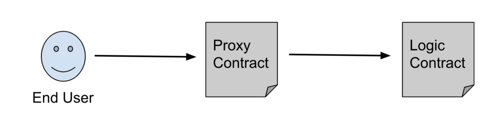

# Upgradable Smart Contracts

This project demonstrates the proxy pattern. It has the architecture shown below.

<br/>



<br/>
By using deployProxy() in OpenZeppelin upgrade plugins, this deployed contract instance can be upgraded later. By default, only the address that initially deployed the contract has the right to upgrade it.

<br/>

> **_NOTE:_** The default pattern is “transparent” but you can specify that you want your proxy to follow the UUPS pattern by explicitly setting that configuration option
(Doc: https://docs.openzeppelin.com/upgrades-plugins/1.x/api-hardhat-upgrades#common-options).

<br/>
Try running some of the following tasks:
<br/>
<br/>

```shell
yarn hardhat run --network sepolia scripts/deploy_upgradeable_pricefeedtracker.js
yarn hardhat console --network sepolia
> const PriceFeedTracker = await ethers.getContractFactory("PriceFeedTracker");
> const priceFeedTracker = await PriceFeedTracker.attach('<<<< YOUR CONTRACT ADDRESS >>>>')
> (await priceFeedTracker.getAdmin())
> (await v1.retrievePrice())

// then upgrade the implementation contract
yarn hardhat run --network sepolia scripts/upgrade_pricefeedtracker.js
> const V2 = await ethers.getContractFactory("PriceFeedTrackerV2")
> const v2 = await V2.attach("<<<< YOUR CONTRACT ADDRESS >>>>")
> const tx = await v2.retrievePrice('0xD4a33860578De61DBAbDc8BFdb98FD742fA7028e') // price feed address
> (await v2.price())

```

## Deployed contract on Sepolia
https://sepolia.etherscan.io/address/0x5e330103da8023bad1bfb65bf5b2f11ff4312872#code
